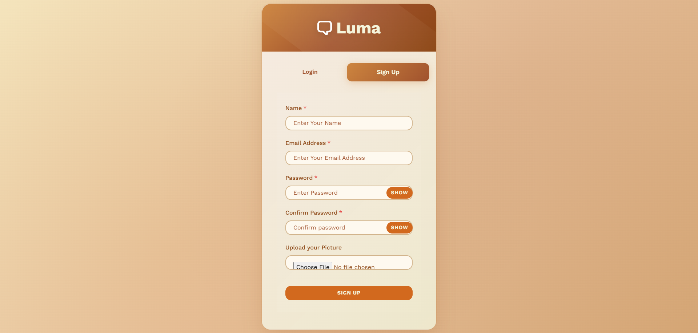

# Luma

Luma is a Full Stack Chatting App.
Uses Socket.io for real time communication and stores user details in encrypted format in Mongo DB Database.

## Tech Stack

**Client:** React JS

**Server:** Node JS, Express JS

**Database:** Mongo DB

## Run Locally

Clone the project

```bash
  git clone https://github.com/Emmetthazel/Luma.git
```

Go to the project directory

```bash
  cd Luma
```

Install dependencies

```bash
  npm install
```

```bash
  cd frontend/
  npm install
```

Start the server

```bash
  npm run start
```

Start the Client

```bash
  //open now terminal
  cd frontend
  npm start
```

## App Preview





